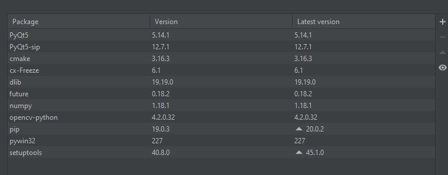

python 版本3.6

需要安装的package

conf 保存各位配置信息
配置项用大写标识

model 存放GUI组件， 组件的实例构成窗口

resources 资源文件， 图片数据等

utils 各种工具类， 图片处理， Httpclient等

view 窗口类 model中各类组件的实例 
再加上一些逻辑组成的 具有实际功能的组件 （
概念源自于web项目的视图层）

app.py 程序执行入口

setup.py 生成exe安装包需要的设置， 
包括作者名称公司，等一些metadata